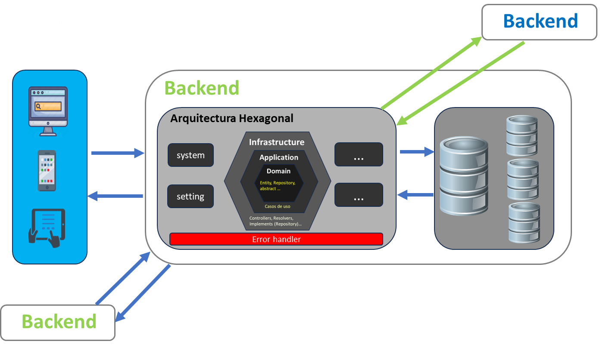
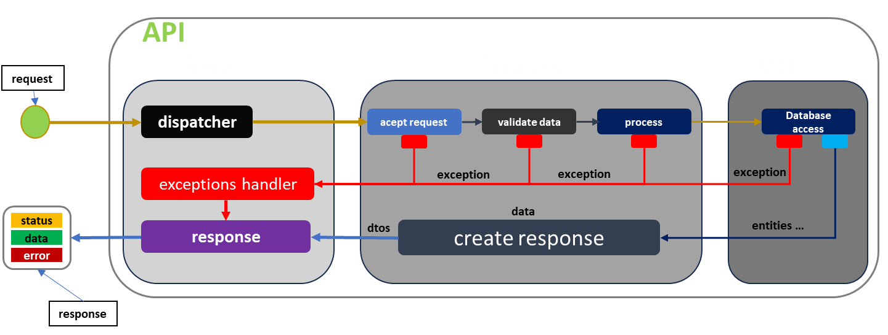
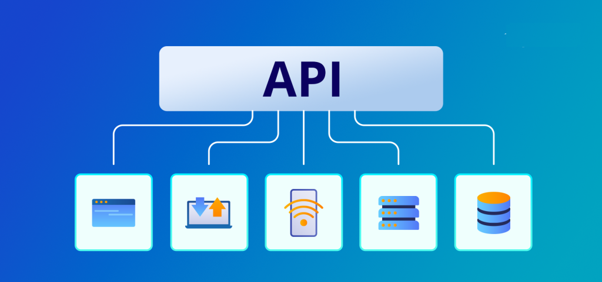

# Backend

El backend se refiere a la parte del software que los usuarios no ven. Es el servidor y la base de datos que ejecutan las funciones principales de una aplicación web o móvil.

## ¿Qué es el Backend?

El backend es la "parte trasera" de una aplicación, es decir, todo lo que sucede detrás de escena.
Esto incluye:

`Servidores:` Las máquinas que alojan y ejecutan el código. <br>
`Bases de datos:` Donde se almacenan los datos de la aplicación. <br>
`APIs:` Interfaces de programación de aplicaciones que permiten la comunicación entre diferentes partes del software.<br>

El backend y la API son dos conceptos fundamentales en el desarrollo de software, pero tienen roles diferentes.

El backend se refiere a la parte del software que se ejecuta en el servidor, donde se procesan las solicitudes, se manejan las bases de datos y se realizan otras operaciones complejas. Un desarrollador backend puede crear una API para que el frontend pueda consumirla y así poder realizar peticiones.

## Diagrama Backend - General

<p align="center">
  <a href="#" target="blank"></a>
</p>

## API

API (Interfaz de Programación de Aplicaciones) es un conjunto de reglas y protocolos que permite la comunicación entre diferentes aplicaciones o componentes de software. En el desarrollo backend, una API se utiliza para definir y establecer la forma en que las solicitudes y respuestas de datos se transmiten entre el frontend y el backend. Es decir, la API es como un mensajero que lleva las solicitudes del frontend al backend y trae las respuestas de vuelta.

- Las API RESTful, o APIs que siguen los principios de la Transferencia de Estado Representacional (REST), se basan en ciertos principios clave:

  - Arquitectura cliente-servidor:
    Las API RESTful se componen de clientes, servidores y recursos, con solicitudes gestionadas a través de HTTP.

  - Comunicación sin estado:
    Cada solicitud del cliente al servidor debe contener toda la información necesaria para comprender y procesar la solicitud. En otras palabras, el servidor no almacena información del cliente entre las solicitudes.

  - Cacheable:
    Las respuestas del servidor pueden ser almacenadas en caché por el cliente. Esto puede mejorar la eficiencia y la escalabilidad de la API al permitir al cliente reutilizar una respuesta anterior.

  - Interfaz uniforme:
    Las API RESTful utilizan una interfaz uniforme, lo que simplifica la arquitectura al tratar cada servicio como un recurso que puede ser creado, leído, actualizado o eliminado.

  - Sistema en capas:
    En una arquitectura RESTful, los componentes se organizan en capas, lo que permite mayor flexibilidad y escalabilidad.

la abstracción mas clara de una api es un endpoint:

En términos de desarrollo web, un endpoint es una URL específica donde una API puede ser accedida. Cada endpoint está asociado con una función específica del backend. Por ejemplo, en una API para un blog, podrías tener endpoints como /posts para obtener todas las publicaciones, /post/1 para obtener la publicación con el ID 1, y /post/new para crear una nueva publicación.

`URL (Uniform Resource Locator):` es la dirección de un recurso en la web. En términos de backend, una URL puede ser vista como un endpoint de una API. Aquí te explico las partes de una URL:

```bash
  https://www.ejemplo.com:8080/ruta/al/recurso?parametro1=valor1&parametro2=valor2
```

1. `Protocolo (https://):` Es el protocolo de comunicación utilizado. Los más comunes son http y https.

2. `Nombre de dominio (www.ejemplo.com):` Es el nombre del servidor que aloja el recurso.

3. `Puerto (:8080):` Es opcional. Los servidores web normalmente escuchan en el puerto 80 para solicitudes HTTP y 443 para solicitudes HTTPS. Si no se especifica un puerto, el navegador utiliza estos puertos por defecto.

4. `Ruta (/ruta/al/recurso):` Es la ruta específica en el servidor donde se encuentra el recurso. En términos de APIs, cada ruta representa un endpoint diferente.

5. `Cadena de consulta (?parametro1=valor1&parametro2=valor2):` Es opcional. Se utiliza para enviar datos no jerárquicos, o datos que no forman parte de la ruta, al servidor.

## Diagrama API - Flujo de datos

<p align="center">
  <a href="#" target="blank"></a>
</p>

### Request

<p align="center">
  <a href="#" target="blank"></a>
</p>

### Response

<p align="center">
  <a href="#" target="blank"></a>
</p>

### Visión general

<p align="center">
  <a href="#" target="blank"></a>
</p>

# Introducción a Express

## ¿Qué es Express?

Express es un framework minimalista para Node.js que simplifica el desarrollo de aplicaciones web y APIs. Es flexible, rápido y cuenta con una amplia comunidad de desarrolladores que contribuyen con módulos y herramientas para facilitar el desarrollo. Express proporciona una capa de abstracción sobre el manejo de solicitudes HTTP y rutas, lo que permite crear aplicaciones web de manera más rápida y eficiente.

- Características Principales de Express:

  - Simplicidad: Express se destaca por su sintaxis simple y fácil de entender, lo que facilita la creación de aplicaciones incluso para principiantes.

  - Flexibilidad: Express no impone una estructura rígida de archivos o un conjunto específico de herramientas, lo que permite a los desarrolladores elegir las mejores prácticas y herramientas para sus proyectos.

  - Middleware: Una de las características más poderosas de Express es su sistema de middleware. El middleware es una serie de funciones que se ejecutan en el proceso de manejo de solicitudes HTTP, lo que permite realizar diversas tareas como autenticación, logging, compresión de respuestas, entre otras.

  - Routing: Express facilita la definición de rutas para manejar solicitudes HTTP. Las rutas pueden coincidir con patrones de URL y métodos HTTP específicos, lo que permite crear una API RESTful de manera sencilla

    ```ts
    const app = express();
    const PORT = 3000;

    app.get("/", (req: Request, res: Response) => {
      res.send("¡Hola Mundo!");
    });

    app.listen(PORT, () => {
      console.log(`Servidor Express corriendo en el puerto ${PORT}`);
    });
    ```

- Middleware en Express:

  - Función Intermedia: El middleware actúa como una función intermedia entre la solicitud que llega al servidor y la respuesta que se envía de vuelta al cliente. Esto permite realizar acciones específicas durante el procesamiento de la solicitud, como la validación de datos, la autenticación de usuarios o el registro de solicitudes.

  - Modularidad: Express permite encadenar múltiples middleware en una aplicación, lo que proporciona una forma modular y flexible de organizar y reutilizar código. Cada middleware se ejecuta en secuencia, permitiendo la creación de pipelines de procesamiento de solicitudes.

  - Control de Flujo: El middleware puede controlar el flujo de ejecución de una solicitud HTTP. Puede decidir si continuar con el siguiente middleware en la pila o enviar una respuesta directamente al cliente, lo que lo convierte en una herramienta poderosa para la gestión de solicitudes y respuestas.

  - Reutilización: Dado que el middleware se puede utilizar en varias rutas o aplicaciones, promueve la reutilización del código y la separación de preocupaciones. Esto facilita el mantenimiento y la escalabilidad de las aplicaciones Express.

    ```ts
    app.use((req: Request, res: Response, next: NextFunction) => {
      console.log(`Solicitud recibida: ${req.method} ${req.url}`);
      next();
    });
    ```

- Middleware de manejo de errores:

  - En Express se definen con una firma de función que toma cuatro argumentos: err, req, res, y next. Express identifica un middleware como un middleware de manejo de errores si tiene cuatro argumentos. Este middleware se ejecutará solo cuando se pase un error a next(). Si no se pasa un error a next(), Express no lo considerará un middleware de manejo de errores y simplemente pasará al siguiente middleware o controlador de ruta.

    ```ts
    app.use((err: Error, req: Request, res: Response, next: NextFunction) => {
      console.error(err.stack);
      res.status(500).send("Algo salió mal!");
    });
    ```

- Gestión de rutas en Express

  - En Express, las rutas son endpoints específicos a los cuales los clientes pueden enviar solicitudes HTTP. La gestión de rutas en Express implica definir las rutas de la aplicación y asociarlas con controladores de ruta que manejen la lógica específica para cada tipo de solicitud HTTP (GET, POST, PUT, DELETE, etc.).

  - Definición de Rutas Básicas
    En Express, puedes definir rutas utilizando métodos como get(), post(), put(), delete(), entre otros, de acuerdo con el tipo de solicitud HTTP que deseas manejar.

    ```ts
    // Ruta básica que responde a solicitudes GET
    app.get("/", (req: Request, res: Response) => {
      res.send("¡Hola Mundo desde Express!");
    });

    // Ruta para manejar solicitudes POST
    app.post("/ruta", (req: Request, res: Response) => {
      // Lógica para manejar la solicitud POST
    });

    // Ruta para manejar solicitudes PUT
    app.put("/ruta/:id", (req: Request, res: Response) => {
      // Lógica para manejar la solicitud PUT
    });

    // Ruta para manejar solicitudes DELETE
    app.delete("/ruta/:id", (req: Request, res: Response) => {
      // Lógica para manejar la solicitud DELETE
    });
    ```

  - Utilizamos métodos como get(), post(), put() y delete() para definir diferentes rutas en la aplicación Express. Cada ruta especifica una URL relativa y un controlador de ruta que manejará la lógica para esa ruta específica.

  - La función de controlador de ruta recibe dos parámetros: req (el objeto de solicitud) y res (el objeto de respuesta), que se utilizan para manejar la solicitud y enviar una respuesta al cliente, respectivamente.

  - Parámetros de Ruta Express permite definir rutas con parámetros, que son partes de la URL que pueden variar en cada solicitud. Los parámetros de ruta se especifican precedidos por dos puntos (:) en la definición de la ruta.
